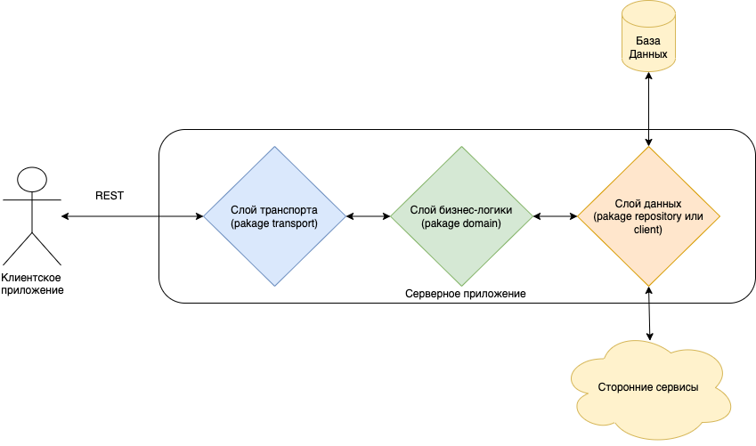

# CRUD. Серверная часть enterprise-приложения

Настало время соединить весь приобретенный опыт из пройденных уроков и применить его к <br>
задаче приближенной к "бизнесу", к тому чем в итоге по большей части мы и занимаемся. <br>
В данном разделе перед нами будет стоять задача спроектировать и реализовать серверную <br>
часть приложения, обслуживающего клиентскую часть импровизированного интернет-магазина. <br>
Мы разберем построение базы данных для хранения бизнес-сущностей, типовую архитектуру приложения, <br>
аутентификацию и авторизацию пользователей, ролевую модель и т.д. <br>

Предположим, нам необходимо реализовать REST-API для интернет-магазина.
Сформулируем -
### User Story
 - Я, как Администратор, хочу иметь возможность добавлять/редактировать и удалять товары и устаналивать/редактировать их цену.
 - Я, как Администратор, хочу иметь возможность добавлять/редактировать и удалять скидки на товары для премиальных пользователей.
 - Я, как Администратор, хочу иметь возможность добавлять/редактировать и удалять скидки на категорию товаров. <br> 
Скидка на товар должна применяться максимально возможная из персональной товара или скидки на всю категорию. 
 - Я, как Пользователь, хочу иметь возможность зарегистрироваться.
 - Я, как Пользователь, хочу иметь возможность войти в аккаунт.
 - Я, как Пользователь, хочу иметь возможность просматривать список товаров магазина.
 - Я, как Пользователь, хочу иметь возможность просматривать карточку товара магазина.
 - Я, как Пользователь, хочу иметь возможность подключить и оплатить премиальный статус пользователя.
 - Я, как Пользователь, хочу иметь возможность добавлять, удалять и очищать корзину товаров.
 - Я, как Пользователь, хочу иметь возможность оплатить свой заказ и указать куда его необходимо доставить.
 - Я, как Пользователь, хочу иметь возможность отменить свой заказ.
 - Я, как Пользователь, хочу иметь возможность просмотреть историю своих заказов.
 - Я, как Пользователь, хочу иметь возможность просмотреть активен ли статус премиальной подписки.
 - Я, как Пользователь, хочу иметь возможность выйти из аккаунта.

Из User Story нам становится ясно, что в системе у нас две роли - Администратор и Пользователь. <br> 
Так же мы получаем понимание того какие сущности (таблицы) мы должны иметь в базе данных нашего приложения. <br> 

### Проектирование Базы Данных
Углубляться в теорию Баз Данных мы не будем, так как это отдельная большая тема и примем, что <br>
обучающийся уже знаком с базовыми понятиями. Для нашего приложения мы возьмем реляционную БД (PostgreSQL), так как <br>
все объекты нашей системы связаны между собой и нам нужно иметь возможность эффективно обращаться за объектами и их связями. <br>
Также мы бы хотели всегда иметь консистентное состояние базы данных после проведения любых манипуляций с объектами в нашей системе. <br>
Начнем с проектирования базы данных под наше приложение. <br>
Для каждого объекта (группы объектов, пример: "Пользователь,Администратор" - роли, товары - сама по себе группа объектов и т.п.) из <br>
User Story, что для нас будет являться и техническим заданием, мы создадим свою таблицу, а для связей многие ко многим - <br>
отдельные таблицы связей. <br>
Так как в теорию БД мы не углубляемся, то просто отмечу, что при проектировании таблиц неплохо обращаться к "нормальным формам" базы данных.<br>
Набросок необходимых сущностей в виде схемы находится в /etc/db_diagram.png <br> 
и там же скрипт создания этих таблиц - /etc/init.sql <br>
_"Для работы с базой данных рекомендуется использовать инструмент - **DBeaver**"_ <br>
Несложно заметить, что в таблицах не хватает полей - ваша задача добавить недостающие поля и связи в ходе разработки.

### Спецификация API
Единственный вид документирования, которым должен заниматься разработчик - это описание контрактной части интеграционных <br>
частей своего приложения.<br>
В нашем приложении одна интеграционная часть - REST API, которую мы предоставляем для клиентских приложений. <br>
Самый популярный формат спецификации - OpenAPI (формально называется Swagger). <br>
Для описания REST-API подготовлен swagger-файл со спецификацией всех методов, необходимых для реализации - /etc/swagger.yaml. <br>
Обычно его готовит lead-разработчик, документирует в процессе разработки, ставит задачи на конекретную реализацию и передает разработчикам клиентской части. <br>
_Для просмотра спецификации и отправки тестовых запросов можно использовать - **https://editor.swagger.io/**_ <br>

### Архитектура приложения
Для наших приложений мы вибираем классический вариант - "слоистую" архитектуру. <br>
Цель - поделить кодовую базу на слои сверху вниз по потоку управления программы. <br>
На верхнем уровне расположив транпортные обработчики, ответственные за поступление входного потока информации в программу и <br>
конвертации входных данных в контракты, которыми оперирует слой ниже - <br>
Слой бизнес-логики приложения, в котором заключается код, ответственный за функциональность, непосредственно необходимую бизнес-задаче. <br>
Например, получить товар, получить цену товара и рассчитать персональную скидку - ответственность за это ложится на код слоя бизнес-логики. <br>
И самый нижний слой - слой доступа к данным. Как правило это слой обращения к хранилищу данных, либо к смежным системам. <br>
Например, получить товар, цену и размер скидки мы должны у БД нашего сервиса. Но допустим в нашей бизнес-задаче еще есть <br>
отправка статистики о интересе проявленном пользователем к товару, а сбором данной статистики занимается сторонний сервис. <br>
Таким образом код, ответственный за обращение к БД и к сервису сбора статистики будет находится на слое доступа к данным. <br>
_Для более глубокого погружения в тему предлагается ознакомится с книгой - **"Чистая Архитектура" Роберт Мартин**_ <br>
**Архитектурная схема**: <br>
 <br>
Реализацию данной архитектурной схемы можно увидеть в "кодовой" части задания. <br> 
Пройдемся подробнее по пакетам и файлам: <br>
- /main.go - точка входа в приложение, занимается чтением конфигурации и вызовом необходимого кода для инициализации приложения в зависимости от режима работы приложения из конфигурации.
- /cmd/... - пакет для кода инициализации приложения под режим работы.
- /etc/... - пакет для файлов справочного или прикладного назначения - шаблоны, схемы и т.п.
- /internal/... - пакет, название которого является ключевым словом - является неэкспортируемым. Так как у нас приложение, а не библиотека, то всю кодовую базу необходимо держать в нем. 
Для библиотек же в свою очередь в данном пакете необходимо размещать код, который не должен быть доступен клиенту библиотеки.
- /internal/config/... - пакет для кода работы с конфигурацией приложения
- **/internal/domain/...** - ключевой пакет для слоя бизнес-логики приложения
- **/internal/repository/...** - ключевой пакет для слоя данных приложения
- **/internal/transport/...** - ключевой пакет для слоя транспорта приложения
- /internal/domain/model/... - пакет для (Data Transfer Object) структур-моделей которыми оперирует бизнес-логика
- /internal/repository/entity/... - пакет для структур-моделей, которые описывают таблицы БД 
- /internal/entity/contract/... - пакет для структур-моделей, которые описывают контракты API
- /migrations/... - пакет для размещения файлов миграции версий БД приложения

### Прочие технические особенности

#### Middleware
Таким термином в нашем случае обозначаются функции-"перехватчики" которые отрабатывают при каждом запросе к серверу. <br>
_[internal/transport/http/middleware.go](internal/transport/http/middleware.go)_ <br>
Они для нас решают задачи, которые необходимо делать для каждого запроса. <br>
- Обработка "паник" (panic recovery) - чтобы приложение не прекращало работу при возникновении panic-и.
- Задание логгеру полей (trace id), необходимых для отслеживания всех записей лога, касающихся этого запроса и помещение логгера в context запроса.
- Централизованная обработка ошибок. Под обработкой в данном случае понимается логирование ошибки. Централизованность в данном случае важна,
дабы избежать двойной обработки одной и той же ошибки.
- Авторизация каждого запроса.
- Логирование отладочной информации по каждому запросу.


#### Аутентификая и авторизация
Аутентификация - процесс при котором мы понимаем кто обращается к нам в систему. <br>
Авторизация - процесс при котором мы проверяем право доступа "обращающегося" к запрошенному ресурсу, происходит после аутентификации. <br>
Для аутентификации пользователей мы будем использовать упрощенную **oauth2**  модель. <br>
В общем случае **oauth2** выглядит следующим образом: <br>

- Resource Owner - пользователь, желающий получить доступ
- Client - клиенсткое приложение: сайт, мобильное приложение и т.п.
- Authorization Server - серверное приложение, ответственное за регистрацию клиентских приложений и "выдачу" токенов доступа. 
Как правило это токен доступа, его время жизни и токен обновления токена доступа. Токен доступа - живет мало, но многоразовый.
Токен обновления - живет долго, но одноразовый. Последний необходим для того чтобы клиент имел возможность не заставлять заново
пользователя заполнять форму логин/пароль при конце действия токена доступа, а незаметно для клиента перезапросить новый токен 
доступа через отправку токена обновления.
- Resource Server - серверное приложение, ответственное за предоставление данных

Таким образом Authorization Server аутентифицирует пользователя и авторизует его доступ до Resource Server. <br>
Resource Server в свою очередь из информации, зашифрованной в токене определяет, не подошел ли к концу срок <br>
жизни токена, что это за пользователь и есть ли у него право доступа до запрашиваемого ресурса. <br>

Разделение на 2 сервера связано с тем, что при множестве "ресурсных" и клиентских приложений удобно иметь единый <br>
сервис, ответственный за выдачу токенов. <br>

Мы же упростим в нашем приложении схему, объеденив серверы в один и реализовав только запрос токена доступа. <br>
[internal/transport/http/handler.go](internal/transport/http/handler.go) - 
тут, в методе Token реализована генерация токена доступа для "тестового" пользователя. <br>
Вам же будет необходимо дописать метод, чтобы он работал и для "честно" зарегистрированных пользователей в системе. <br>
[internal/transport/http/middleware.go](internal/transport/http/middleware.go) -
тут, в функции authMiddleware описан процесс проверки доступа пользователя к ресурсу. <br>
Проверку доступа на основе роли пользователя и ее прав Вам предстоит дописать самостоятельно. <br>

#### Работа с ролевой моделью
Каждой роли доступны свои методы REST-API. Для обеспечения проверки доступа нам будет необходимо в таблицу прав (permissions) занести <br>
уникальное имя для каждого метода. В нашем случае таким может послужить связка HTTP-метода и "хвоста" маршрута по которому идет запрос, <br>
например, **GET/orders** <br>
Через таблицу связей мы соединим права с ролями, а роли в свою очередь с пользователями через другую таблицу связей. <br>

#### Работа с базой данных
Классически существуют два подхода работы с БД в языках с сильным ORM (Object-Relational Mapping) инструментарием - code first и database first. <br>
Для code first изначально требуется описание модели данных связей и ограничений в коде из которого в свою очередь ORM движок генерирует базу данных. <br>
В database first же наоборот, требуется сначала создать БД, а из нее ORM движок сгенерирует структуры (классы, сущности) и методы для работы с ними. <br>
К сожалению, в Го нет хороших ORM, есть неплохие попытки, но любую из них полноценным ORM не назвать в сравнении, например, с Java Hibernate или C# Entity Framework. <br>
Неплохими вариантами библиотек по работе с БД являются:
- _[https://github.com/go-pg/pg](https://github.com/gofiber/fiber)_ (Только PostgreSQL, что уже вызывает вопрос - почему создатели считают это ORM-ом, но как библиотека работы с Postgres неплохая)
- _[https://github.com/volatiletech/sqlboiler](https://github.com/gofiber/fiber)_ (PostgreSQL, MySQL, MSSQL, CockroachDB, SQLLite. Поддерживает подход - database first)

Выбор инструмента - на Ваше усмотрение. От себя добавлю, что для классической CRUD приятнее и быстрее использовать database first подход. <br>
Он позволяет избежать написания множества "рутинного" как на старте, так и в процессе изменения/доработки приложения. <br>
Запросы к БД можно генерировать как через функционал ORM движка, так и в "сыром" виде. <br>
Для рутинных и простых запросов лучше подойдет функционал движка, для сложных запросов - лучше "сырой", "самописный" SQL запрос, <br>
результат которого Вы "смапите" в структуру. <br>

установка утилиты-генератора sqlboiler: <br>
```shell
    # sqlboiler
    go install github.com/aarondl/sqlboiler/v4@latest
    go install github.com/aarondl/sqlboiler/v4/drivers/sqlboiler-psql@latest
```
пример команды для генерации:
sqlboiler -c etc/config.template.yml -p entity -o internal/repository/pg/entity --struct-tag-casing camel --add-soft-deletes --no-tests --wipe psql

флаги: <br>
- -c etc/config.template.yml - путь до файла конфигурации с секцией конфигурации подключения к БД
- -p entity - название пакета для сгенерированных структур
- -o internal/repository/pg/entity - путь до директории, в которую необходимо расположить результат работы генератора - структуры для таблиц и методы работы с ними.

#### HTTP-сервер
Для организации работы HTTP-сервера была выбрана библиотека Fiber Framework <br>
_[https://github.com/gofiber/fiber](https://github.com/gofiber/fiber)_ <br>
Она удобнее чем страндартный пакет http, работает быстрее, имеет богатый функционал (маршрутизация, middleware и пр.) <br>
и очень хорошую документацию. <br>

### Задание

- Довести до конца проектирование БД
- Сгенерировать или описать вручную структуры по работе с БД. Создать функционал в repository по работе с пользователями и дописать механизм аутентификации/авторизации. 
Таким образом мы закончим функционал сервера Authorization Server и авторизационную часть в Resource Server.
- Реализовать методы из swagger-спецификации, протестировать работу методов используя swagger-ui

